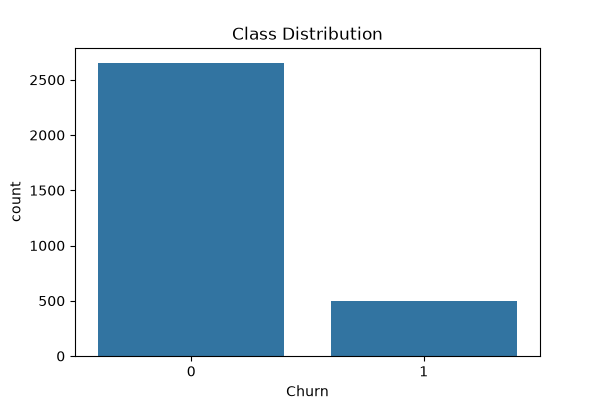
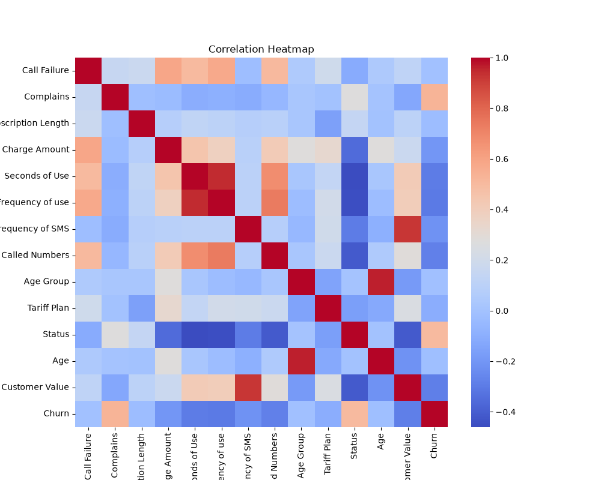
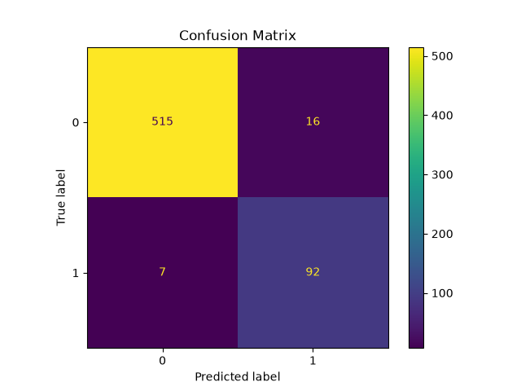
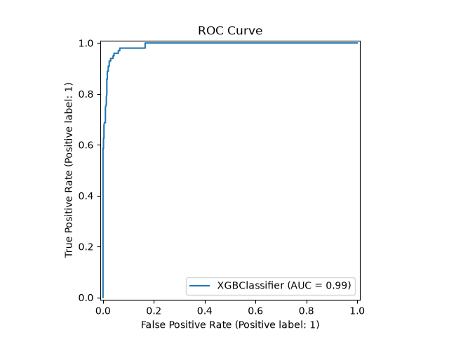

# 📞 Iranian Customer Churn Prediction Using Machine Learning

## 📌 Project Overview

Customer churn is one of the most important business challenges in the telecommunications industry. Predicting whether a customer is likely to leave a service helps organizations improve retention strategies and reduce revenue loss.

This project implements a complete **End-to-End Machine Learning Pipeline** using the **Iranian Churn Dataset** from the UCI Machine Learning Repository. The pipeline includes data preprocessing, exploratory data analysis, feature engineering, class imbalance handling, model training, hyperparameter tuning, evaluation, and deployment through a Streamlit web application.

---

## 🎯 Objectives

* Predict customer churn using historical telecom customer data.
* Handle class imbalance using SMOTE.
* Compare multiple machine learning models.
* Perform cross-validation and hyperparameter tuning.
* Deploy the final model using Streamlit.
* Provide an interactive prediction interface.

---

## 📂 Dataset Information

**Dataset:** Iranian Churn Dataset

**Source:** UCI Machine Learning Repository

**Records:** 3,150

**Features:** 13

**Target Variable:** Churn

### Features

* Call Failure
* Complains
* Subscription Length
* Charge Amount
* Seconds of Use
* Frequency of Use
* Frequency of SMS
* Distinct Called Numbers
* Age Group
* Tariff Plan
* Status
* Age
* Customer Value

### Target

* 0 → Customer Retained
* 1 → Customer Churned

---

## 🛠 Tech Stack

### Programming Language

* Python

### Libraries

* Pandas
* NumPy
* Matplotlib
* Seaborn
* Scikit-Learn
* Imbalanced-Learn (SMOTE)
* XGBoost
* Joblib
* Streamlit

---

## 📁 Project Structure

```text
iranian-churn-pipeline/
│
├── artifacts/
│   ├── best_model.joblib
│   ├── scaler.joblib
│   ├── feature_columns.joblib
│   └── model_comparison.csv
│
├── data/
│   └── Customer Churn.csv
│
├── images/
│   ├── class_distribution.png
│   ├── correlation_heatmap.png
│   ├── confusion_matrix.png
│   └── roc_curve.png
│
├── src/
│   ├── train.py
│   ├── predict.py
│   ├── app.py
│   └── utils.py
│
├── REPORT.md
├── README.md
└── requirements.txt
```

---

## 🔍 Exploratory Data Analysis

EDA was performed to understand the dataset characteristics and identify patterns.

### Generated Visualizations

* Class Distribution Plot
* Correlation Heatmap

### Key Findings

* Dataset contains class imbalance.
* Churned customers represent the minority class.
* Usage-related features show strong relationships with churn behavior.

---

## ⚙️ Feature Engineering

The following preprocessing steps were applied:

* Column cleaning
* Feature scaling using StandardScaler
* Target separation
* Train-Test Split

---

## ⚖️ Class Imbalance Handling

The dataset was imbalanced:

### Before SMOTE

| Class     | Count |
| --------- | ----- |
| Non-Churn | 2124  |
| Churn     | 396   |

### After SMOTE

| Class     | Count |
| --------- | ----- |
| Non-Churn | 2124  |
| Churn     | 2124  |

SMOTE was used to generate synthetic samples of the minority class and improve model learning.

---

## 🤖 Models Compared

Three machine learning models were trained and evaluated using Stratified 5-Fold Cross Validation.

| Model               | CV F1 Score |
| ------------------- | ----------- |
| Logistic Regression | 0.8774      |
| Random Forest       | 0.9785      |
| XGBoost             | 0.9743      |

---

## 🎛 Hyperparameter Tuning

RandomizedSearchCV was used to optimize the XGBoost model.

### Best Parameters

```python
{
    'subsample': 0.8,
    'n_estimators': 300,
    'max_depth': 5,
    'learning_rate': 0.05
}
```

---

## 📊 Final Model Performance

### Evaluation Metrics

| Metric    | Score  |
| --------- | ------ |
| Accuracy  | 96.35% |
| Precision | 85.19% |
| Recall    | 92.93% |
| F1 Score  | 88.89% |
| ROC-AUC   | 99.04% |

---

## 📈 Generated Visualizations

### Class Distribution

Add screenshot here:

```markdown

```

### Correlation Heatmap

```markdown

```

### Confusion Matrix

```markdown

```

### ROC Curve

```markdown

```

---

## 🚀 Running the Project

### Clone Repository

```bash
git clone https://github.com/yourusername/iranian-churn-pipeline.git

cd iranian-churn-pipeline
```

### Install Dependencies

```bash
pip install -r requirements.txt
```

### Train Model

```bash
python src/train.py
```

### Run CLI Prediction

```bash
python src/predict.py
```

### Launch Streamlit Dashboard

```bash
streamlit run src/app.py
```

---

## 💻 Streamlit Dashboard Features

* Customer Churn Prediction
* Probability Score
* Interactive User Inputs
* Model Performance Metrics
* Professional Dashboard Interface

---

## 🔮 Future Improvements

* SHAP Explainability
* Deep Learning Models
* Real-Time API Deployment
* Cloud Deployment (AWS/Azure)
* Automated Retraining Pipeline
* Customer Retention Recommendation Engine

---

## 👨‍💻 Author

**Mareti Satish**

B.Tech Computer Science & Engineering (AI)
KL University