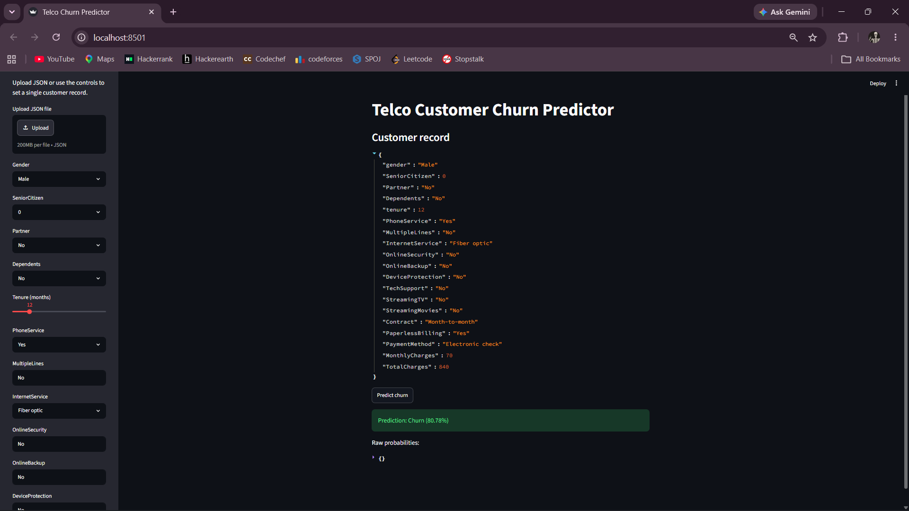

# Telco Customer Churn Pipeline

End-to-end machine learning pipeline for the Kaggle / IBM Telco Customer Churn dataset.

## What This Project Does

* Runs EDA on the cleaned dataset and saves a written summary.
* Engineers features from the raw Telco columns.
* Trains and compares three models with stratified cross-validation.
* Handles class imbalance with SMOTE and class-weighted estimators.
* Tunes the strongest model with randomized search.
* Saves the final model bundle with `joblib`.
* Exposes a simple CLI for churn predictions.
* Provides a Streamlit web interface for easy predictions.

---

## Application Output

<p align="center">
  
</p>

<p align="center">
  <b>Telco Customer Churn Predictor - Streamlit Dashboard</b>
</p>

---

## Expected Dataset

Download the Telco Customer Churn CSV from Kaggle and place it in the project directory or provide its path when training.

The dataset should contain the following columns:

* `customerID`
* `gender`
* `SeniorCitizen`
* `Partner`
* `Dependents`
* `tenure`
* `PhoneService`
* `MultipleLines`
* `InternetService`
* `OnlineSecurity`
* `OnlineBackup`
* `DeviceProtection`
* `TechSupport`
* `StreamingTV`
* `StreamingMovies`
* `Contract`
* `PaperlessBilling`
* `PaymentMethod`
* `MonthlyCharges`
* `TotalCharges`
* `Churn`

---

## Installation

Install all required dependencies:

```bash
pip install -r requirements.txt
```

If your environment uses the provided typo file, this also works:

```bash
pip install -r requriments.txt
```

---

## Train the Model

Run the training pipeline:

```bash
python train.py --data-path "WA_Fn-UseC_-Telco-Customer-Churn.csv"
```

Artifacts generated after training:

* `artifacts/telco_churn_model.joblib`
* `artifacts/eda_summary.md`
* `artifacts/model_comparison.csv`

---

## Predict (CLI)

### Interactive Mode

```bash
python app.py
```

### JSON Mode

```bash
python app.py --input-json '{"gender":"Male","SeniorCitizen":0,"Partner":"No","Dependents":"No","tenure":1,"PhoneService":"Yes","MultipleLines":"No","InternetService":"Fiber optic","OnlineSecurity":"No","OnlineBackup":"No","DeviceProtection":"No","TechSupport":"No","StreamingTV":"No","StreamingMovies":"No","Contract":"Month-to-month","PaperlessBilling":"Yes","PaymentMethod":"Electronic check","MonthlyCharges":70.0,"TotalCharges":70.0}'
```

---

## Run Streamlit Web App

Launch the Streamlit application:

```bash
streamlit run streamlit_app.py
```

If Streamlit is not recognized:

```bash
python -m streamlit run streamlit_app.py
```

The application will open in your browser at:

```text
http://localhost:8501
```

---

## Project Structure

```text
AZENTRIX-FULLSTACK-TASK2/
│
├── image/
│   └── imagesoutput.png.png
│
├── train.py
├── app.py
├── streamlit_app.py
├── churn_pipeline.py
├── requirements.txt
├── REPORT.md
├── README.md
├── WA_Fn-UseC_-Telco-Customer-Churn.csv
│
└── artifacts/
    ├── telco_churn_model.joblib
    ├── eda_summary.md
    └── model_comparison.csv
```

---

## Notes

* The model is trained on the standard Telco churn schema; if your CSV uses different column names, align them before training.
* SMOTE is applied only on the training folds and training split, not on the final test set.
* The saved bundle contains the trained pipeline, model comparison table, and evaluation metrics.
* The project demonstrates the complete machine learning lifecycle from data preprocessing to deployment.

# Author : Mareti Satish
"# azentrix_fullstack_task2" 
