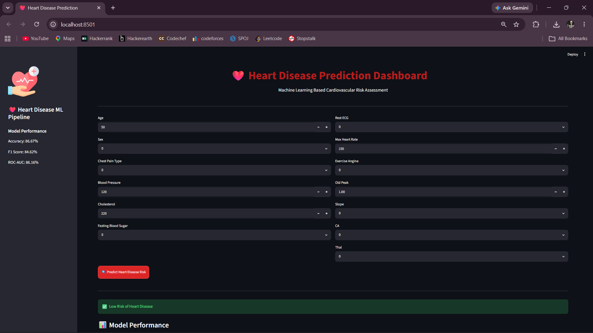

# ❤️ Heart Disease Prediction System

An End-to-End Machine Learning Pipeline for predicting the likelihood of heart disease using the UCI Cleveland Heart Disease Dataset. This project demonstrates the complete ML workflow including Exploratory Data Analysis (EDA), Feature Engineering, Class Imbalance Handling, Model Training, Hyperparameter Tuning, Model Evaluation, and Deployment through a Streamlit web application.

---

## 📌 Project Overview

Heart disease is one of the leading causes of death worldwide. Early prediction can help healthcare professionals identify high-risk patients and take preventive actions.

This project uses machine learning techniques to predict whether a patient is likely to have heart disease based on various medical attributes.

---

## 🎯 Problem Statement

Build a complete machine learning pipeline on a real-world healthcare dataset that:

* Performs Exploratory Data Analysis (EDA)
* Applies Feature Engineering
* Handles Class Imbalance using SMOTE
* Trains and compares multiple ML models
* Uses Cross Validation for reliable evaluation
* Performs Hyperparameter Tuning
* Saves the best model using Joblib
* Deploys predictions through a Streamlit Dashboard

---

## 📊 Dataset Information

**Dataset:** UCI Cleveland Heart Disease Dataset

* Records: 297
* Features: 13 Medical Attributes
* Target Variable: `condition`

  * 0 = No Heart Disease
  * 1 = Heart Disease Present

### Features

| Feature  | Description                       |
| -------- | --------------------------------- |
| age      | Age                               |
| sex      | Gender                            |
| cp       | Chest Pain Type                   |
| trestbps | Resting Blood Pressure            |
| chol     | Cholesterol Level                 |
| fbs      | Fasting Blood Sugar               |
| restecg  | Resting ECG Results               |
| thalach  | Maximum Heart Rate Achieved       |
| exang    | Exercise Induced Angina           |
| oldpeak  | ST Depression                     |
| slope    | Slope of Peak Exercise ST Segment |
| ca       | Number of Major Vessels           |
| thal     | Thalassemia                       |

---

## 🛠️ Technologies Used

* Python
* Pandas
* NumPy
* Matplotlib
* Seaborn
* Scikit-Learn
* Imbalanced-Learn (SMOTE)
* Joblib
* Streamlit

---

## 📈 Exploratory Data Analysis

The following analyses were performed:

* Target Distribution
* Correlation Heatmap
* Age vs Heart Disease Analysis
* Cholesterol Distribution
* Feature Relationship Analysis

Generated Visualizations:

* Target Distribution
* Correlation Heatmap
* Age vs Condition
* Cholesterol Distribution
* Confusion Matrix

---

## ⚙️ Feature Engineering

* Data Validation
* Train-Test Split
* Feature Scaling using StandardScaler
* Data Preparation for Model Training

---

## ⚖️ Class Imbalance Handling

The dataset was balanced using **SMOTE (Synthetic Minority Oversampling Technique)** to improve model learning and reduce bias toward the majority class.

---

## 🤖 Models Compared

Three machine learning algorithms were evaluated using Stratified 5-Fold Cross Validation.

| Model               | Mean F1 Score |
| ------------------- | ------------- |
| Logistic Regression | 0.8186        |
| Random Forest       | 0.8200        |
| Gradient Boosting   | 0.8092        |

### Best Model

**Random Forest Classifier**

---

## 🔍 Hyperparameter Tuning

RandomizedSearchCV was used to optimize Random Forest parameters.

### Best Parameters

```python
{
    'n_estimators': 100,
    'min_samples_split': 5,
    'max_depth': 10
}
```

---

## 📊 Final Model Performance

| Metric    | Score  |
| --------- | ------ |
| Accuracy  | 86.67% |
| Precision | 91.67% |
| Recall    | 78.57% |
| F1 Score  | 84.62% |
| ROC-AUC   | 86.16% |

---

## 📸 Dashboard Demo

Add your Streamlit dashboard screenshot here:

```markdown

```

---

## 📂 Project Structure

```text
heart-disease-pipeline/
│
├── data/
│   └── heart.csv
│
├── artifacts/
│   ├── target_distribution.png
│   ├── correlation_heatmap.png
│   ├── age_vs_condition.png
│   ├── chol_distribution.png
│   ├── confusion_matrix.png
│   └── model_comparison.csv
│
├── models/
│   ├── heart_disease_model.joblib
│   └── scaler.joblib
│
├── src/
│   ├── train.py
│   ├── predict.py
│   └── utils.py
│
├── app.py
├── REPORT.md
├── requirements.txt
└── README.md
```

---

## 🚀 Installation

Clone the repository:

```bash
git clone https://github.com/YOUR_USERNAME/heart-disease-prediction.git
cd heart-disease-prediction
```

Create virtual environment:

```bash
py -m venv .venv
```

Activate environment:

```bash
.venv\Scripts\activate
```

Install dependencies:

```bash
pip install -r requirements.txt
```

---

## ▶️ Run Training

```bash
py src/train.py
```

---

## 💻 Run CLI Prediction

```bash
py src/predict.py
```

---

## 🌐 Run Streamlit Dashboard

```bash
py -m streamlit run app.py
```

---

## 🔮 Future Improvements

* Add XGBoost and LightGBM models
* Deploy on Streamlit Cloud
* Add SHAP Explainability
* Add Feature Importance Visualization
* Build REST API using FastAPI
* Support Batch Predictions

---

## 👨‍💻 Author

**Mareti Satish**

B.Tech Computer Science and Engineering
Specialization: Artificial Intelligence & Computational Intelligence

